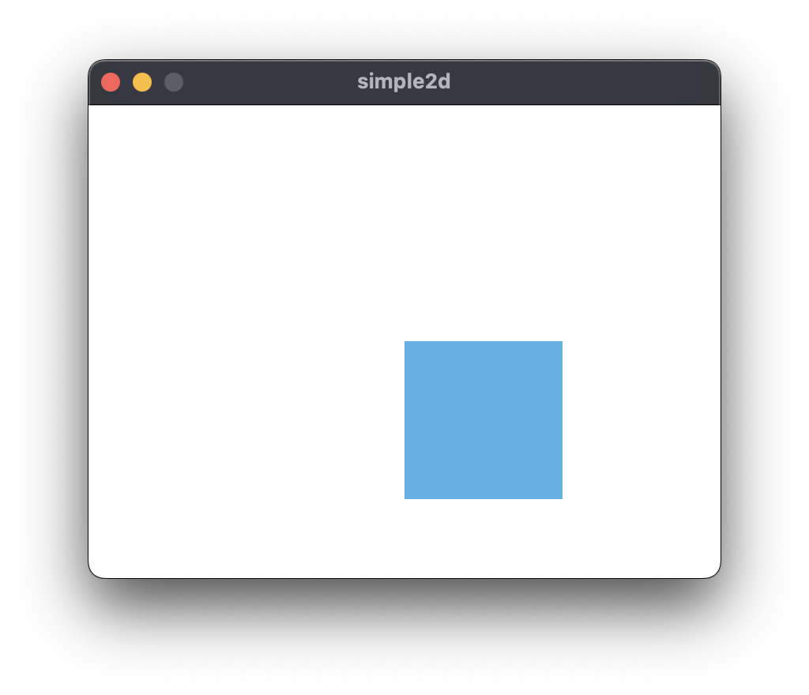

# simple2d

simple2d is an example use of the srgl library. \
Simply opens a window. 

```rust
use srgl::CanvasBuilder;
use srgl::Shape;
use nalgebra::Vector3;
use srgl::Color;

fn main() -> Result<(), srgl::Error> {
    CanvasBuilder::new()
        .with_title(String::from("simple2d"))
        .with_size(400, 300)
        .with_s2d(Shape::make_rect(Vector3::new(200., 150., 0.),
                                   Vector3::new(300., 250., 0.),
                                   Color::from([0x48, 0xb2, 0xe8, 0xff])))
        .build().run()
}
```

